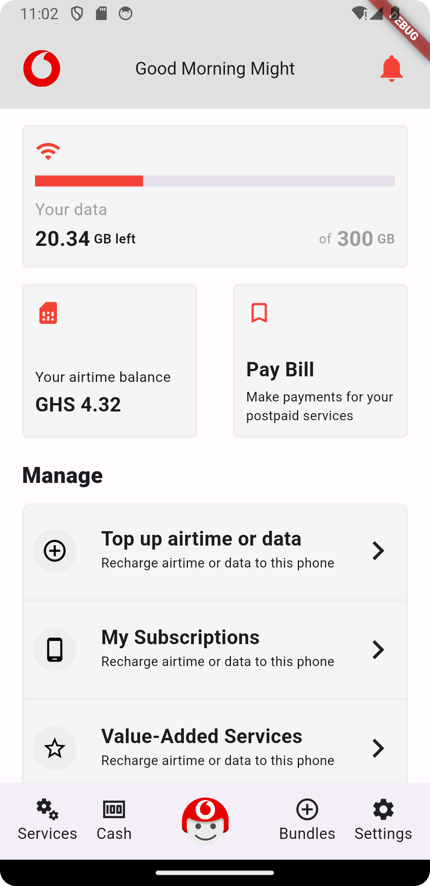

Vodafone Ghana App Redesign

This project showcases a redesigned homepage for the Vodafone Ghana app, offering a refreshed user interface and improved user experience. Explore the modernized design, enhanced features, and optimized performance.

### Redesigned Features:

- Intuitive Navigation: Streamlined navigation for easier access to key app sections.
- Visual Overhaul: A visually appealing and modernized design to enhance the overall user experience.
- Performance Improvements: Optimized app performance for faster loading times and smoother interactions.
- Enhanced Functionality: Improved functionality and additional features to meet user needs more effectively.

### Screenshots:

### Technologies Used:

- Flutter
- Dart

### Contributing:

Contributions are welcome! If you have any ideas, improvements, or bug fixes, feel free to open an issue or submit a pull request.

### License:

This project is licensed under the MIT License - see the [LICENSE](LICENSE) file for details.

